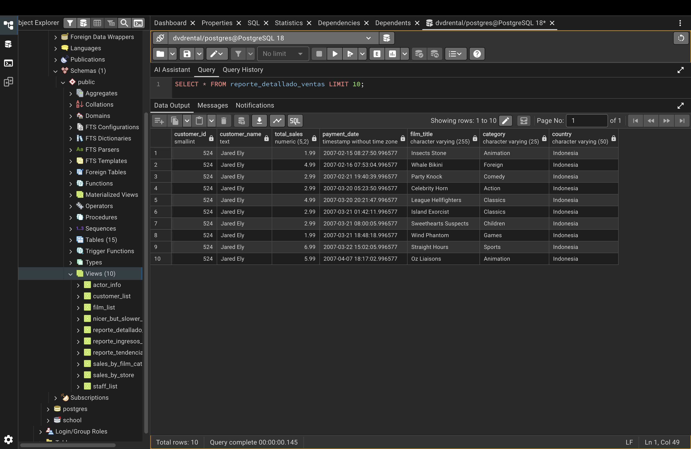

# Customer Success Operations & Performance Dashboard
- **Tech Stack:** PostgreSQL (SQL Views), Power BI, Relational Data Modeling (Star Schema)

## Context
This project features an end-to-end BI pipeline designed to track customer behavior and revenue health. I transformed raw relational data into a strategic tool for Customer Success leadership to monitor KPIs, identify churn risks, and uncover growth opportunities by ensuring a "single source of truth" across the organization.

## Problem
To support data-driven decision-making, CS leadership needed to answer critical operational questions that were previously difficult to track due to fragmented data:
- **Customer Health & Revenue:** Monitoring monthly revenue trends to identify performance drivers and potential churn.
- **Market Segmentation:** Analyzing top-performing categories and regions to optimize resource allocation for Customer Success Managers (CSMs).
- **Operational Efficiency:** Identifying high-value customers to prioritize proactive engagement and improve Customer Lifetime Value (CLV).

## Actions & Technical Implementation

### 1. Data Engineering with SQL (Database Logic)
I developed custom SQL Views to handle data cleaning and pre-aggregation. This approach ensures the Power BI model remains lightweight and scalable by shifting heavy computations to the database layer (PostgreSQL/Snowflake logic).



```sql
CREATE OR REPLACE VIEW customer_revenue_metrics AS
SELECT
    r.customer_id,
    c.first_name || ' ' || c.last_name AS customer_name,
    c.email,
    ct.city,
    cu.country,
    f.title AS film_title,
    cat.name AS category,
    p.amount AS revenue,
    r.rental_date,
    EXTRACT(MONTH FROM r.rental_date) AS rental_month,
    EXTRACT(YEAR FROM r.rental_date) AS rental_year
FROM rental r
JOIN payment p ON r.rental_id = p.rental_id
JOIN customer c ON r.customer_id = c.customer_id
JOIN address a ON c.address_id = a.address_id
JOIN city ct ON a.city_id = ct.city_id
JOIN country cu ON ct.country_id = cu.country_id
JOIN inventory i ON r.inventory_id = i.inventory_id
JOIN film f ON i.film_id = f.film_id
JOIN film_category fc ON f.film_id = fc.film_id
JOIN category cat ON fc.category_id = cat.category_id;
```

**[View Full SQL View Script Definitions in Repository](../sql/cs_analytics_views.sql)**

### 2. Data Architecture & Relational Modeling (Star Schema)

To support deep-dive analysis, I architected a centralized Star Schema model. By establishing relationships between the core transactional data (`Query1`) and key operational dimensions, the model enables seamless cross-filtering across customer demographics and staff performance.

- **Centralized Fact Table:** `Query1` aggregates revenue and rental events for precise KPI tracking.
- **Multi-Dimensional Visibility:** Connections to `public_customer_list`, `public_staff_list`, `sales_by_store`, and `sales_by_film_category` allow leadership to pinpoint exactly which segments or team members are driving growth.

### 3. Process Improvement & Visualization

The dashboard follows an executive design philosophy focused on **Outcomes over Activity**:

- **Root Cause Identification:** Interactive drill-downs allow the team to understand the "why" behind performance trends.
- **Clarity for Stakeholders:** Strategic use of whitespace and high-contrast KPI cards ensures leadership can identify pain points in seconds.
- **Scalable Framework:** Built to handle ad-hoc questions from CS leadership regarding specific customer segments or regional shifts.

## Results & Business Outcomes

- **System Optimization:** Improved reporting efficiency by automating transformations via SQL.
- **Repeatable Data Models:** Built a scalable architecture for monitoring recurring operational processes.
- **Actionable Insights:** Translated complex rental datasets into a clear narrative for process improvement and executive presentations.
- **Key Executive Metrics Delivered:**
  - **$61.31K** Total Revenue tracked.
  - **599** Active Customers monitored.
  - **108** Market Reach locations analyzed.
  - **14.596K** Total Rentals processed.
