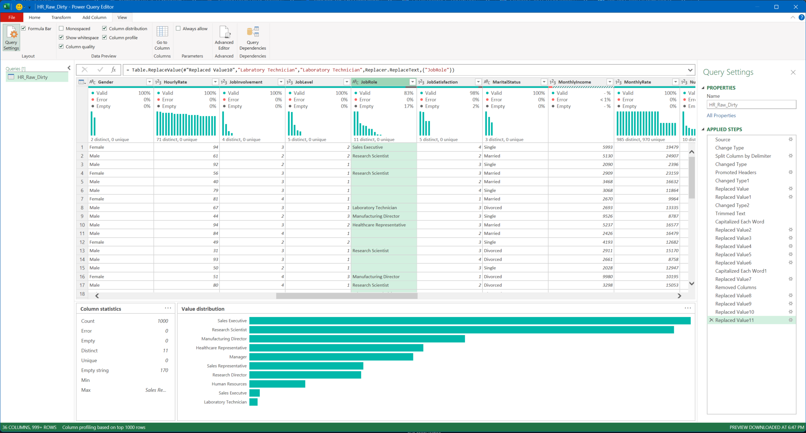
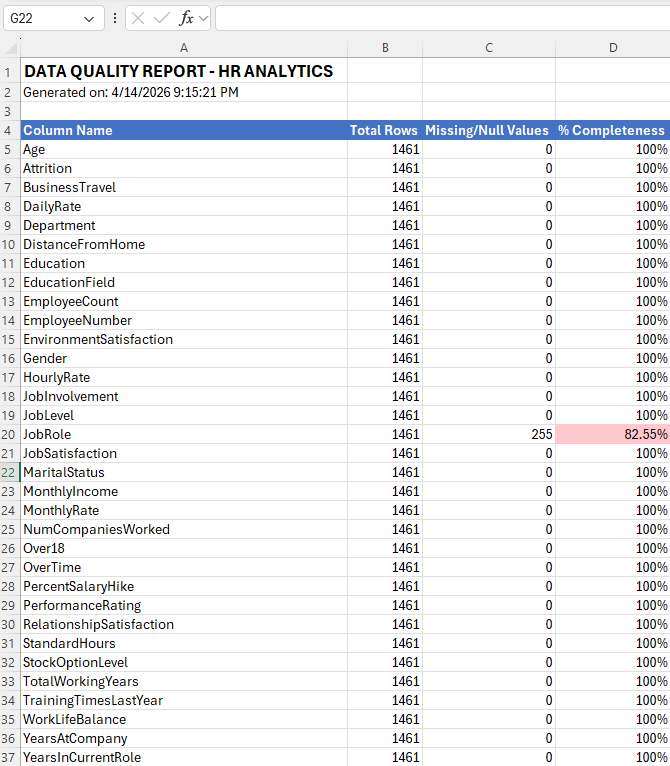
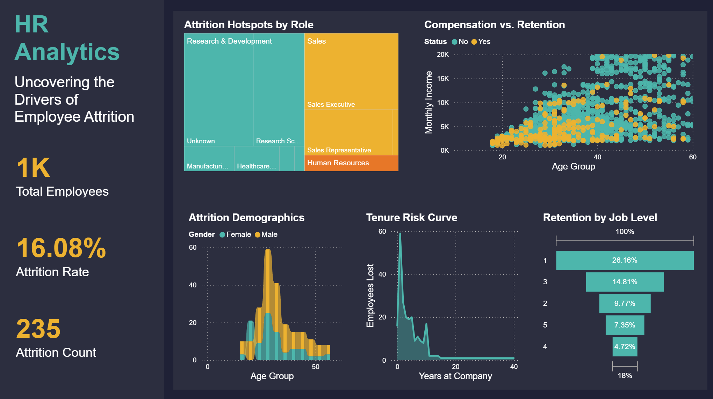
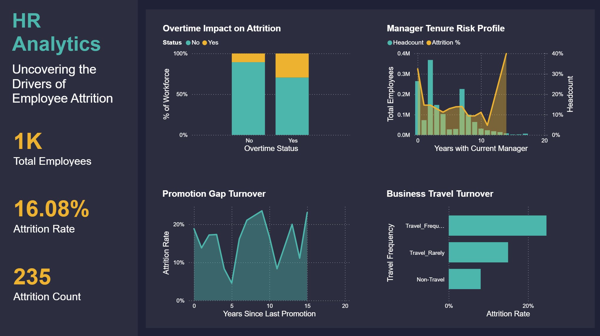

# HR Analytics - Uncovering the Drivers of Employee Attrition
- **Tech Stack:** Excel (Power Query, M Language, Advanced Formulas), VBA (Macro Automation), Power BI (Data Modeling, DAX)

## Context
Employee attrition is a silent profit killer — high turnover disrupts operations and drives up recruitment and training costs. In this end-to-end project, I took on the role of HR Data Analyst to uncover the root causes of employee turnover using the IBM HR Analytics dataset, transforming a messy raw CSV into a dynamic, executive-level diagnostic tool.

## Problem
The company was losing valuable employees without knowing why. The raw dataset itself was unusable in its initial state — a single unparsed text column with inconsistent categories, mixed data types, broken formats, duplicates, and nulls. Leadership needed clear answers to:
- **Attrition Hotspots:** Which departments and roles are bleeding the most talent?
- **Employee Profile:** What characterizes an employee who is likely to leave?
- **Satisfaction & Work-Life Balance:** How do these factors correlate with turnover?
- **Retention Priorities:** Where should the company focus its efforts for maximum impact?

## Actions & Technical Implementation

### 1. Data Structuring & Cleaning (Power Query)
I parsed the raw, unstructured CSV into a proper table, corrected data types column by column, and standardized inconsistent categorical values (typos, mixed capitalization, synonyms) using Trim, Capitalize Each Word, and targeted Replace Values steps — diagnosing issues through Power Query's Column Profile feature rather than relying on prior knowledge of the errors.



### 2. Strategic Handling of Nulls & Errors
Rather than a blanket deletion (which would have cost ~20% of the dataset), I applied three targeted strategies:
- **Exclusion** of invalid financial records (negative/error salaries) via custom M code:
```powerquery
Table.SelectRows(#"Previous Step", each ([Monthly Income] > 0))
```
- **Statistical imputation** of missing ordinal survey scores (e.g., `JobSatisfaction`) using the scale's median value.
- **Categorical imputation** of empty-string job roles into an explicit `"Unknown"` category, preserving all 255 affected records for analysis.

### 3. Feature Engineering (Excel)
I dropped a corrupted `DateofJoining` field in favor of the already-clean `YearsAtCompany` metric, then engineered new analytical categories with nested `IF` formulas to make trends visualization-ready:
```excel
=IF([@Monthly Income]<3000, "Low", IF([@Monthly Income]<6000, "Medium", IF([@Monthly Income]<10000, "High", "Very High")))
```

### 4. Automated Data Quality Auditing (VBA)
I built a custom VBA macro that scans the full dataset on demand, calculates completeness per column, and generates a formatted audit report with conditional highlighting — confirming a **100% completeness rate** before the data reached Power BI.


**[View Full VBA Script Definitions in Repository](../vba/vba_hr_data_quality_report.bas)**

### 5. Data Modeling & DAX (Power BI)
I connected Power BI directly to the cleaned Excel workbook and built a dedicated `Measures` table with core DAX KPIs powering the entire dashboard:
```dax
Total Employees = COUNTROWS('HR_Analytics_Data')
Attrition Count = CALCULATE([Total Employees], 'HR_Analytics_Data'[Attrition] = "Yes")
Attrition Rate = DIVIDE([Attrition Count], [Total Employees], 0)
```

### 6. Interactive Dashboard Design
I designed a two-page report separating **"what is happening"** (Executive Summary: demographics, hotspots by department/role, compensation vs. retention) from **"why it is happening"** (Operational Drivers: overtime burnout, manager-tenure risk, travel and commute impact). The final UI uses a dark-mode executive aesthetic with a fixed KPI/navigation panel and consistent color coding (turquoise = retained, orange = attrited).




## Results & Business Outcomes
- **Data Integrity:** Achieved 100% completeness across all critical columns, verified through automated auditing.
- **Key Diagnostic Insight:** Identified a critical attrition spike (30%+) during an employee's first year under a new manager ("Year 0" effect).
- **Burnout Signal:** Quantified that employees working overtime churn at more than double the rate of those who don't.
- **Actionable Recommendations Delivered:**
  - A "Leadership Transition" coaching program for new managers.
  - An overtime audit to flag understaffing or inefficient processes.
  - Targeted retention and compensation review for high-risk roles (Sales Representatives, Laboratory Technicians).
