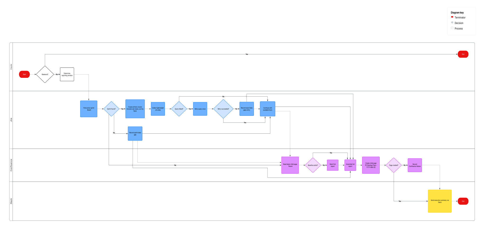

# AI-Powered Daily Standup Briefing: Restoring Sprint Visibility with Automation

## Context

I'm the Product Owner of the Platform Experience team, the configuration and management layer of a B2B2C platform. Every other stream (core APIs, client SDKs, hosted solutions, developer documentation) has to pass through our layer to ship, so our backlog isn't a single team's backlog. It holds **multiple epics from different teams**, from customer-facing console features and security capabilities to partner integrations and production support.

Sprints run two weeks, and on average we carry **~61 primary items per sprint** (stories, tasks and bugs, excluding sub-tasks).

Work moves through a multi-stage workflow (Submitted, In Progress, Code Review, Ready for QA, In QA Review, Ready for UAT, plus Blocked), and the team runs four stand-ups a week, one of them focused on estimation, plus product backlog refinement. Keeping that board accurate depends on delivery hygiene: timely status updates, blocker follow-up and cross-team dependency tracking.

## The Problem

At one point in the quarter, the board stopped telling the truth. **23 items** were sitting in "Ready for QA" or "In QA Review", 18 of them in the active sprint, and **10 had been waiting 25+ days (~1.8 sprints)**. Three items had triggered Jira's automatic alert for carrying over **9 sprints** without closing. Statuses often contradicted reality: QA hours were logged against items still marked "Ready for QA", an item rejected in review still looked like it was waiting for QA, and one fix sat untested for **31 days (~2.2 sprints)** after development finished it. Other items had been in the same status for **20+ days (~1.4 sprints)** with no documented reason, blocked items carried no reason or cited dependencies that were already Done or Cancelled, and whole chains of related stories hadn't started with nothing on the board to explain why.

The pain point wasn't missing data; it was missing a trustworthy daily signal. Keeping the board accurate relied on manual follow-up that wasn't happening consistently, and stand-ups had moved to a fast, epic-level review where individual stale items were easy to miss. When a blocker was raised, it was acknowledged without an owner or a next step, and some were never raised at all. To compensate, I audited the backlog by hand for **~45 minutes every day**, effectively covering two roles: owning the product and auditing the board.

The cost added up. Blockers surfaced late or not at all, so unblocking and escalation happened late. Stand-up time went to asking for status instead of solving problems. Active QA work looked idle, while overloaded or departed team members stayed hidden behind stale statuses. And I couldn't separate what was in progress from what was truly stopped, which weakened forecasts and stakeholder updates, with critical items for a strategic partner and a customer-required security capability among those affected.

## My Role

This wasn't in my job description or on my backlog. As Product Owner, I'm accountable for the backlog and for outcomes, and that accountability rests on transparency: if I can't see where the sprint really stands, I can't inspect progress, re-prioritize or help unblock the team.

As a technical PO, I don't stop at flagging a gap. I sit between business intent and engineering reality, I understand how the workflow, the data behind it and the integrations fit together, and I'm comfortable building the tooling when it doesn't exist. So I treated the visibility gap like any other product problem: start from the need, define what "good" looks like, and ship the smallest thing that works.

**The solution** is an AI agent built on Claude and connected to Jira, Confluence and Slack through MCP connectors. Every weekday at 6:30 am it audits the active sprint, compares it with the previous day's report, and delivers a one-page briefing to Confluence plus a short summary in Slack. The full design is in the next section.

**How I thought about it:**

1. **Start from what I need to see before every stand-up:** what changed, what is blocked and why, and what has gone quiet.
2. **Trust only what can be verified.** If the data can't confirm something, the briefing says so instead of guessing.
3. **Make it comparable day over day,** so I read what's new instead of re-reading everything.
4. **Start simple and refine.** My first version pulled too much data, so I rebuilt it around small, targeted queries and separated true blockers from outdated fields.
5. **Inform decisions, don't make them.** Prioritization and refinement stay with me.

## The Automation Flow

The flow runs in five stages every weekday at 6:30 am.

**1. Trigger.** A scheduled task starts a Claude agent. It skips weekends and sets the time window: the last 24 hours, or since Friday on Mondays.

**2. Context.** The agent resolves the active sprint of my team's board, scoped to the board and not to the sprint name, so look-alike sprints from other teams never mix in. It then loads yesterday's report as the baseline for "what's new."

**3. Collect.** Five lightweight query branches, each built to return only small result sets:

- **Status changes:** one query per source status, giving from → to for every ticket that moved.
- **Days in status:** threshold queries (5, 6, 7, 10, 14 and 30 days) that bucket every idle ticket by exact age.
- **Blocked since:** day-by-day date probing that finds the exact date a ticket entered Blocked.
- **Comments:** read in small batches, ignoring automation noise and keeping decisions, asks and PO mentions.
- **Blockers:** block reason, flags, issue links and recent comments, classified as documented, partial or contradictory, or undocumented.

**4. Compose.** The agent assembles a one-page report in ten fixed sections, in English, using only verified facts.

**5. Deliver.** The full report is published to Confluence and a short summary is sent to my Slack. If anything fails, a Slack alert explains what went wrong instead of failing silently.

**Key design decisions:**

- **Lightweight over exhaustive:** small, targeted queries instead of heavy data pulls.
- **Facts or silence:** anything unverifiable is listed under "Data gaps."
- **Two surfaces, two depths:** Confluence for the full picture, Slack for the 30-second version.
- **A feedback loop:** today's report becomes tomorrow's baseline, which is what makes "what changed since yesterday" possible.

### The Report Template (Confluence)

| Section | What it contains |
| :--- | :--- |
| **Header** | Sprint name and dates, business days left, the time window used and the ticket count |
| **TL;DR** | The three things I must know before the meeting, in plain language |
| **New since last report** | Blockers that appeared or cleared, and tickets added to or removed from the sprint |
| **Blockers** | Ticket, owner, blocked since (date and days), reason, and a documentation check |
| **Status changes** | Every ticket that moved in the window, shown as from → to with its owner |
| **5+ days in the same status** | Idle tickets grouped by status, with exact age |
| **Relevant comments** | A one-line synthesis of decisions, questions and asks, with items needing PO input marked |
| **Questions for standup** | Up to five concrete questions derived from the data above |
| **Board by epic and status** | Every primary ticket, grouped by epic and ordered like the board |
| **Data gaps** | Appears only when a query failed, and names exactly what is missing |

### The Slack Summary

The headline version, in under 15 lines:

> **Standup Prep:** the date, the sprint and the business days left
> **Key points:** the three facts that matter most before today's stand-up
> **Blockers:** one line each, with days blocked and documentation status
> **Movement:** the count of status changes and of tickets idle 5+ days
> **Questions for standup:** the top questions to raise
> **Full report:** a link to the Confluence page

### Flow Diagram

## Impact

| Metric | Before | After |
| :--- | :--- | :--- |
| **Daily prep time** | ~45 min reading the backlog | ~5 min reading the briefing (**~89% reduction**) |
| **Time recovered** | n/a | **~3+ hrs/week, ~6-7 hrs/sprint** |
| **Blocker awareness** | Learned live in the stand-up, or not at all, since some blockers were never raised in the daily scrum | Surfaced before the meeting, with days blocked and documentation status |
| **Idle-ticket visibility** | Ad hoc, manual checks | Every ticket idle 5+ days (~0.4 sprints) listed daily with exact age |

The briefing turned a daily 45-minute audit into a 5-minute read, and the real change went beyond the time saved. I stopped chasing the board and started leading from it. Every stand-up now begins with the sprint already analyzed: what moved, what is blocked and for how long, which items have gone quiet, and which questions to ask. Across a ~61-item, multi-team backlog, I went from reacting to surprises to staying on top of every moving part.

I showed the briefing to my Product Manager, and we **scaled the solution to other roles**, with a personalized version for each: **Technical Manager, Tech Lead, Product Manager and Technical Project Manager.** The feedback was very positive, with the same takeaway every time: it keeps me on top of everything happening in the sprint, without the daily scramble.

This project is how I like to work with technology: define the problem clearly, design the logic, build it with the tools available, and iterate until the team trusts it.
